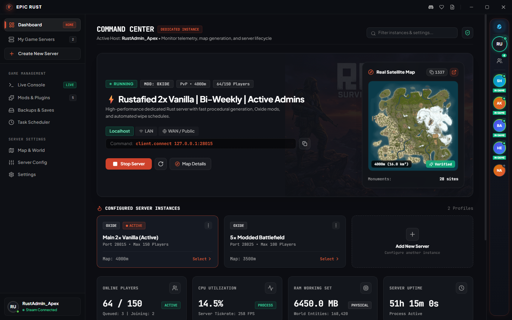
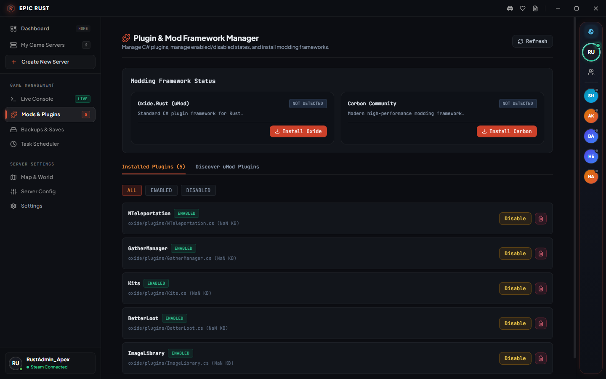
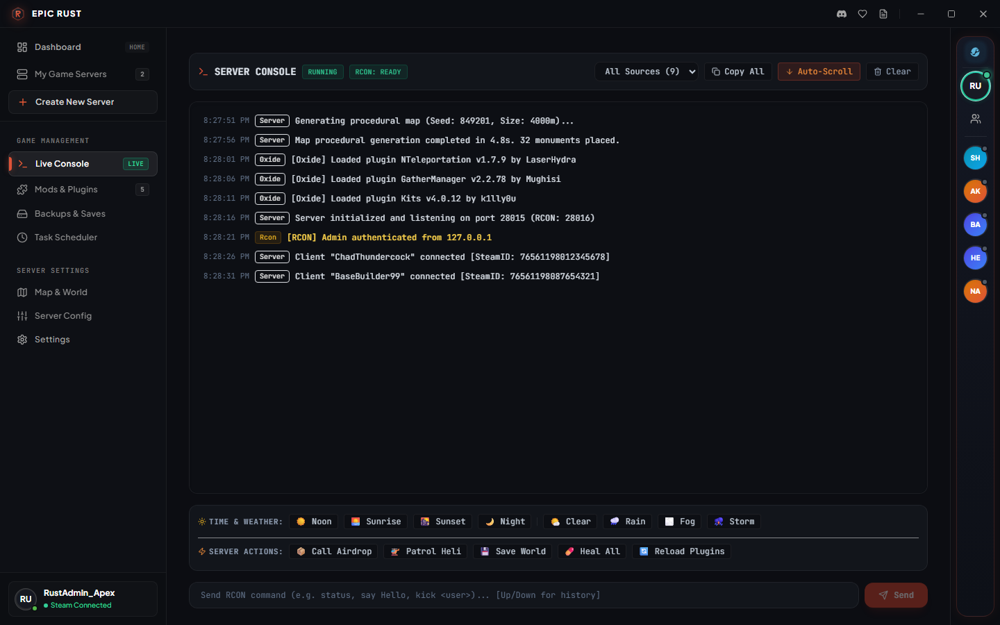

# 🔥 Epic Rust — Rust Dedicated Server Launcher & Manager

  

  <strong>The easiest, most powerful GUI launcher to install, host, manage, and mod your Rust Dedicated Server on Windows.</strong>

  
  
  
  

---

## ⚡ What is Epic Rust?

Setting up a **Rust Dedicated Server** manually usually means dealing with messy command-line `.bat` scripts, tedious SteamCMD installations, port confusion, and digging through nested directories just to wipe a map or add a plugin.

**Epic Rust** turns that entire process into a seamless **1-click experience**. Whether you want to host a private server to play with friends, run a 2x Vanilla community, or build a 100-player 5x modded battlefield, **Epic Rust** provides all the tools you need inside a sleek, tactical dark-mode desktop interface.

---

## 📸 Screenshots

### 🖥️ Command Center & Real-Time Server Telemetry
> Monitor live player counts, server tickrate & FPS, CPU/RAM utilization, map generation, and direct connect links at a single glance.

---

### 🧩 1-Click Oxide (uMod) & Carbon Plugin Manager
> Install, toggle, and manage Rust mods and plugins directly with zero FTP or manual file copying.

---

### 📡 Live Interactive RCON Console & Quick Actions
> Real-time colored server console, instant weather controls, and tactical server commands (Airdrops, Patrol Heli, Heal All).

---

## ✨ Features Server Owners Love

- **🚀 1-Click Rust Dedicated Server Setup**
  - Instant SteamCMD integration: automatically downloads, validates, and updates official Rust server files.
  - Zero terminal knowledge needed — start, stop, and restart your server with a single click.
  - Auto-detects existing Rust server installations across all local drives and Steam libraries.

- **🧩 Native Oxide (uMod) & Carbon Plugin Ecosystem**
  - Switch between **Vanilla**, **Oxide**, and **Carbon** frameworks in one click.
  - Integrated uMod marketplace browser to search and install C# plugins instantly.
  - Toggle plugins on or off with instant live configuration reloading.

- **⏰ Automated Wipe & Restart Scheduler**
  - Schedule automated daily restarts and periodic server wipes (weekly, bi-weekly, monthly).
  - In-game broadcast warnings (`Restart in 15m / 5m / 1m`) to alert players before restarts.
  - Automated procedural seed rotation and clean save file cleanup during wipes.

- **👥 Steam Friends Quick-Invite Dock**
  - Integrated Steam overlay & friend presence dock.
  - See which friends are online or playing Rust in real time.
  - 1-Click "Invite to Server" and "Invite All Online Friends" with automated connect links.

- **🗺️ Procedural & Custom Map Generator**
  - Seed generator and world size controller (1,000m to 6,000m) with real-time topology preview.
  - Direct integration with RustMaps.com for instant monument visualization.
  - Full support for custom map `.map` URLs (RustEdit & community maps).

- **📡 Real-Time Telemetry & Interactive RCON**
  - Ultra-low latency interactive RCON console with command history.
  - Real-time performance monitors: Server FPS, player counts, queue status, RAM & CPU load, entity count.
  - Quick-action buttons: Change weather (Rain, Fog, Clear, Storm, Day/Night), call Airdrops, summon Patrol Heli.

- **💾 Save States, Backups & Instant Rollbacks**
  - Automated snapshot backups before every update or wipe.
  - 1-Click save restoration to protect against server crashes or map corruption.

- **⚖️ Gameplay Rules & SteamID Admin Manager**
  - Graphical sliders for decay rates, upkeep, radiation, helicopter events, and NPC behavior.
  - Manage server owners and moderators with synchronized `users.cfg` permissions.

- **🔄 Multi-Server Profiles**
  - Run and switch between multiple independent server profiles (e.g. Vanilla, 2x, 5x, Build Server) on custom ports.

---

## 📥 Download & Quick Start

Getting your **Rust Dedicated Server** online takes less than 2 minutes:

1. **[Download the Latest Release](https://github.com/hamza007hh/Epic-Rust-Launcher/releases)** (`EpicRust.exe`).
2. Run **`EpicRust.exe`**.
3. Click **"Install Server"** (or choose your existing Rust server folder).
4. Hit **"Start Server"** — your Rust Dedicated Server is live!
5. Copy your **Direct Connect** command (`client.connect IP:PORT`) and share it with your friends!

---

## 🔍 Requirements

- **Operating System**: Windows 10 or Windows 11 (64-bit)
- **Rust Client / Steam**: Steam installed and running (for friend invites and SteamCMD)
- **RAM**: 8 GB minimum (16 GB+ recommended for populated servers)

---

## 📜 License

Distributed under the MIT License. See [LICENSE](LICENSE) for more details.

---

  Keywords: rust dedicated server, rust server launcher, rust server manager, host rust server, rust server gui, rust dedicated server windows, rust server installer, steamcmd rust server, rust oxide manager, rust umod plugins, rust wipe scheduler, rust rcon console

